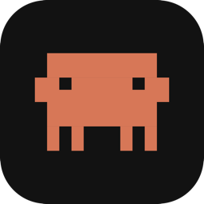
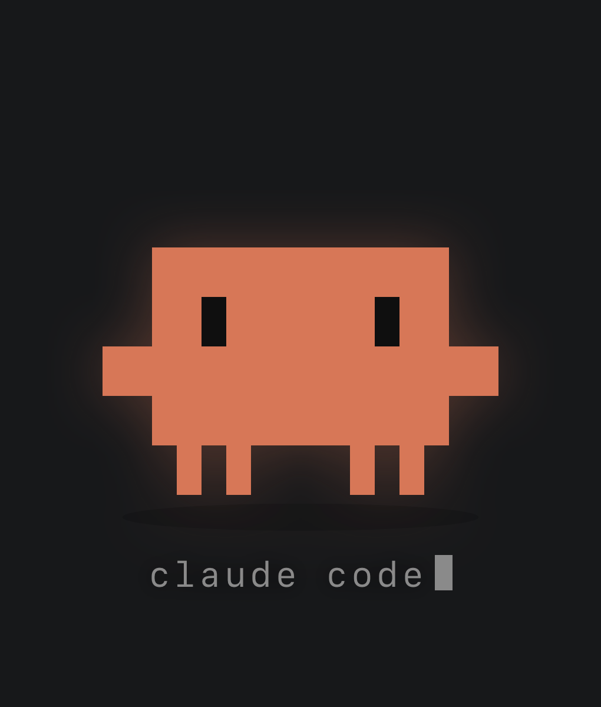
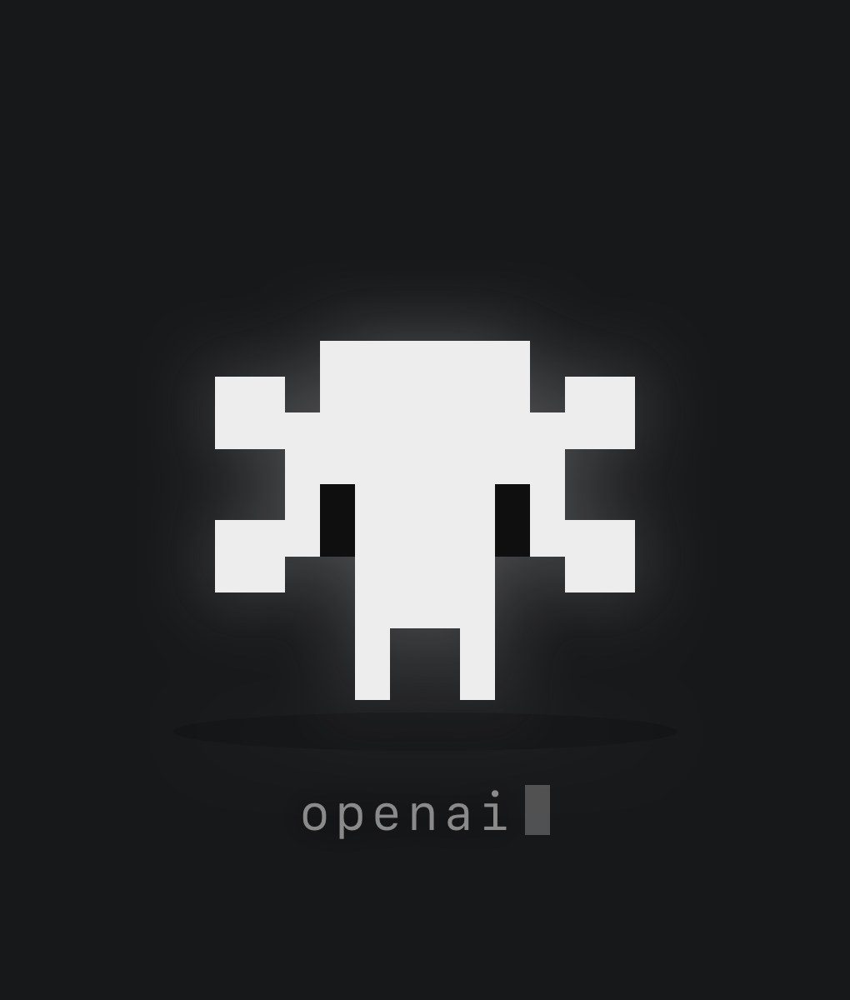
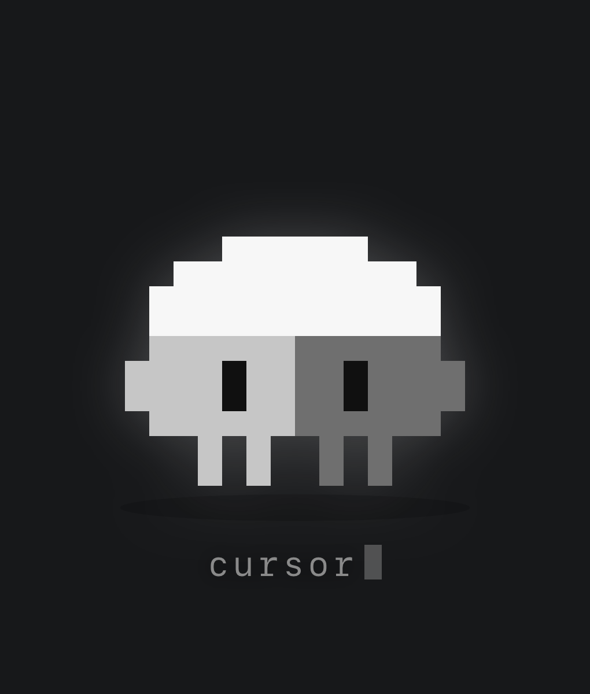
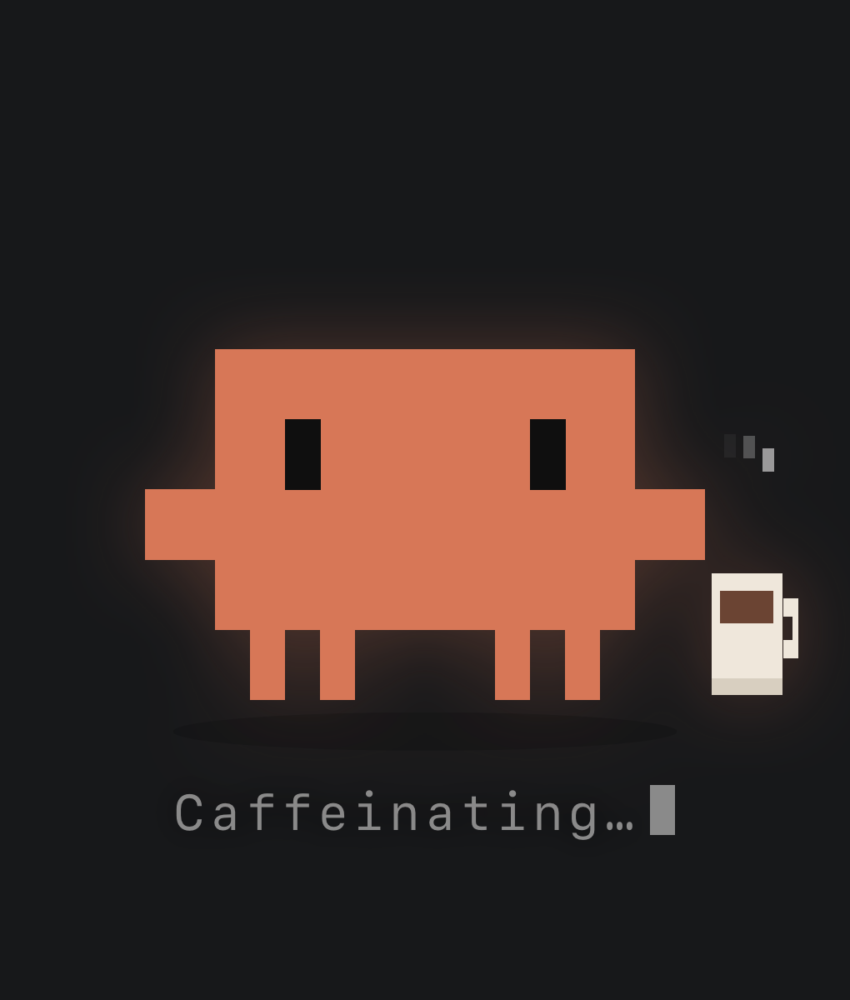
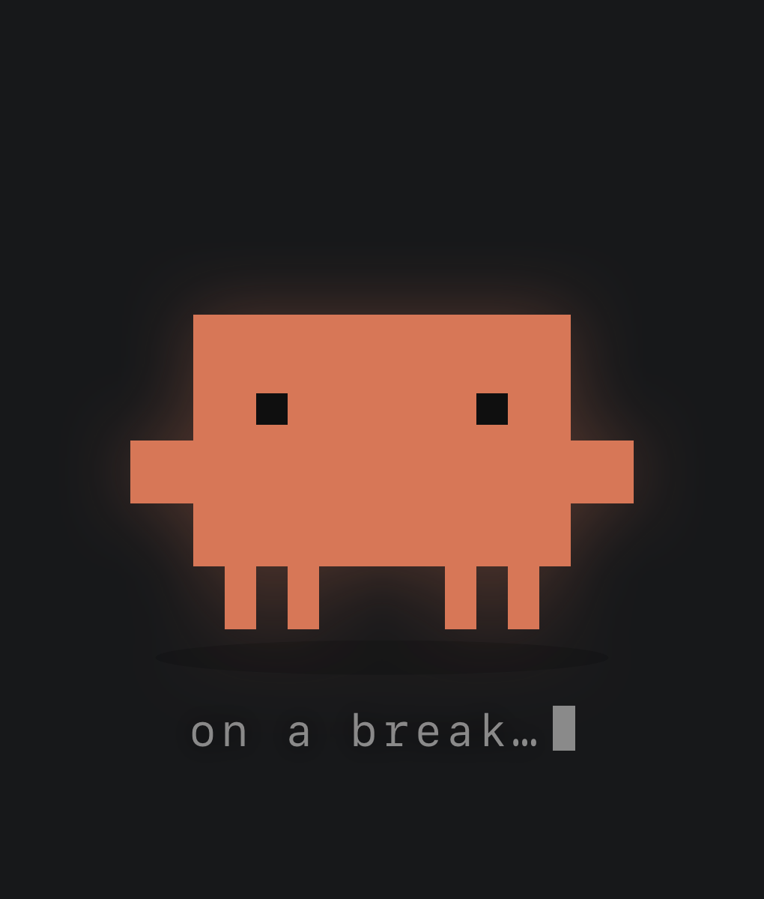

<p align="center">
  
</p>

<h1 align="center">mascot-screensaver</h1>

<p align="center">
  <b>Clawd, the Claude Code pixel mascot, lives on your desktop and keeps your Mac awake.</b><br>
  (Yes, it is technically the opposite of a screensaver.)
</p>

<p align="center">
  
</p>

If you run long AI-agent sessions (Claude Code and friends), macOS will happily sleep the display and lock the screen mid-run, so you come back to a password prompt instead of your agent's progress. Mascot holds a display-sleep assertion while a tiny pixel pet keeps you company.

macOS only. One small universal binary, no dependencies, no network access, no analytics.

## Pick your mascot

Three skins, switchable live from the menu bar (each with its own signature antics):

| Clawd | Blossom | Cube |
|:---:|:---:|:---:|
|  |  |  |
| The Claude Code mascot, faithful to the terminal art. Drinks coffee, thinks in sparkles. | Inspired by the OpenAI blossom. Does a full wind-up spin and blooms its petals. | Inspired by the Cursor cube. Flips through fake 3D and ghost-completes its own label (tab, tab). |

## Features

- **Keeps the display awake** with a proper IOKit power assertion (`PreventUserIdleDisplaySleep`). Not a mouse jiggler: no fake input, nothing moves your cursor.
- **Three switchable mascots**: authentic pixel Clawd (official orange, terminal-accurate 1:2 pixel proportions), a blossom, and a cube, all drawn on the same grid. Switching poofs one out and pops the next in.
- **Alive**: breathes, blinks, glances around, and its eyes follow your cursor.
- **Idle antics per mascot**: everyone stretches and shuffles; Clawd drinks coffee and thinks in ✻ sparkles, the blossom spins and blooms, the cube 3D-flips and plays autocomplete with its own label.
- **Interactive**: hover for a blush and a wave, click for a happy hop, drag it anywhere (it tilts in your hand and lands with a squash).
- **Never in your way**: the window is click-through everywhere except Clawd's actual body, so it cannot block clicks on whatever is behind it.
- **Menu bar control** (✻): pause keeping-awake (Clawd visibly dozes off), ask for a wave or a coffee, reset position, launch at login, quit.
- Remembers where you left it, floats above full-screen apps, and shows its state at a glance:

| Caffeinating | On a break (keep-awake paused) |
|:---:|:---:|
|  |  |

## Install

### Download

1. Download `Mascot.app.zip` from the [latest release](../../releases/latest) and unzip it.
2. Drag `Mascot.app` into `/Applications`.
3. First launch: **right-click the app → Open** (it is ad-hoc signed, not notarized), or clear the quarantine flag:

   ```bash
   xattr -dr com.apple.quarantine /Applications/Mascot.app
   ```

Clawd appears at the top-right of your screen, and ✻ joins your menu bar.

### Build from source

Requires the Xcode Command Line Tools (`xcode-select --install`).

```bash
git clone https://github.com/maulmota/mascot-screensaver.git
cd mascot-screensaver
./build.sh --install
```

`build.sh` compiles a universal binary, bundles the app, draws the icon, ad-hoc signs it, and (with `--install`) replaces `/Applications/Mascot.app` and relaunches it.

## Usage

The menu bar symbol matches the active mascot (✻ / ⬡ / ▮) and dims while keep-awake is paused.

| Action | Result |
|---|---|
| Hover the mascot | Blush, a little wave, and the close button appears |
| Click the mascot | Happy hop |
| Drag the mascot | Move it anywhere; position is remembered |
| Menu → Mascot | Switch between Clawd, Blossom, and Cube |
| Menu → Keep Mac awake | Toggle the assertion. When off, the pet dozes and the display may sleep |
| Menu → Say hi | A wave |
| Menu → Coffee break / Spin / Tab, tab | The active mascot's signature trick |
| Menu → Reset position | Send it back to the top-right corner |
| Menu → Launch at login | Start with your Mac (macOS 13+) |

## How it works

Three files, no frameworks:

- **`MascotApp.swift`**: a borderless floating window plus a menu bar item. While enabled it holds `IOPMAssertionCreateWithName(kIOPMAssertionTypePreventUserIdleDisplaySleep, ...)`. It also polls the global mouse position at 20 Hz to flip `ignoresMouseEvents`, which is what makes the window click-through everywhere except the pet, and to feed cursor coordinates to the page for eye tracking.
- **`mascot.html`**: the entire pet. An SVG pixel grid plus a small behavior engine (idle scheduler, eye springs, typed label, particles). Each mascot is a data-defined skin (body rects, eye positions, colors, label vocabulary, and its own event table) on the same footprint, so the hitbox and behaviors are shared. Swift streams pointer and drag data in; the page reports its clickable hitbox out.
- **`build-icon.swift`**: draws the app icon programmatically at build time.

Clawd's sprite geometry and the official body color, `rgb(215,119,87)`, were reconstructed from Claude Code's terminal art. Terminal quadrant "pixels" are twice as tall as they are wide, which is exactly why Clawd is this stout.

## Limitations

- It keeps your display on, which uses more power. Toggle it off from the menu when you do not need it.
- Corporate device-management (MDM) policies that force a screen lock can override display assertions.
- macOS 12 or later (launch at login requires macOS 13). macOS only, by design.

## Development

- `./start.command` runs the Swift source directly, no build step, for quick iteration.
- Art and behavior tuning live in `mascot.html`: each skin is a plain-data entry in the `SKINS` table (geometry, colors, label vocabulary, event weights). Adding a fourth mascot is mostly drawing rects.
- Open `mascot.html` in a browser to preview the pet; mouse movement and clicks stand in for the native cursor feed. `?skin=clawd|openai|cursor` selects a mascot and `?pose=coffee|think|spin|bloom|flip|tabtab|stretch|shuffle|sleep|wave` triggers a pose for screenshots.

## Disclaimer

This is an unofficial fan project, not affiliated with or endorsed by Anthropic, OpenAI, or Anysphere. Clawd, Claude, and Claude Code are Anthropic's trademarks; the OpenAI name and blossom mark belong to OpenAI; Cursor and its cube mark belong to Anysphere. The pixel mascots here are original fan-art interpretations, drawn from scratch as chunky creatures with feet. If any of these companies would like their mascot removed (or would like to send stickers), please open an issue.

## License

[MIT](LICENSE)
